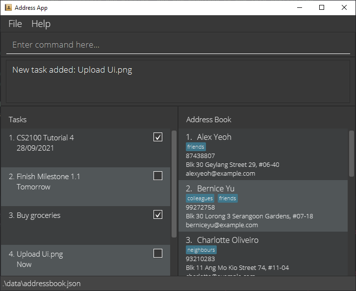

# AY2122S1-CS2103-F09-2 TaskMaster2103

TaskMaster2103 helps a student manage their tasks and help them keep up with their busy lives in school. It is optimised for both CLI and GUI users so that students can choose which ever method is preferred for themselves.

For detailed documentation on the project, please visit the [TaskMaster2103 product website](https://ay2122s1-cs2103-f09-2.github.io/tp/).

## Getting Started

Prerequisites: JDK11, Gradle

For **running the application**: Head to our [releases](https://github.com/AY2122S1-CS2103-F09-2/tp/releases) page and grab the latest `.jar` file.

For **contributing to the project**:

1. Clone this repository
2. Open the project in an IDE that has gradle support, or simply run `./gradlew task -all` in the root directory of the project.
3. Submit your PR and assign it to any one of our developer team members to notify us!

## About Us

Please refer to the [About Us](https://github.com/AY2122S1-CS2103-F09-2/tp/blob/master/docs/AboutUs.md) document.

## User Guide

Please refer to the [User Guide](https://github.com/AY2122S1-CS2103-F09-2/tp/blob/master/docs/UserGuide.md) document for specific details.

## Developer Guide

Please refer to the [Devleoper Guide](https://github.com/AY2122S1-CS2103-F09-2/tp/blob/master/docs/UserGuide.md) for specific details.

## Acknowledgements

This project is based on the AddressBook-Level3 project created by the [SE-EDU initiative](https://se-education.org).
