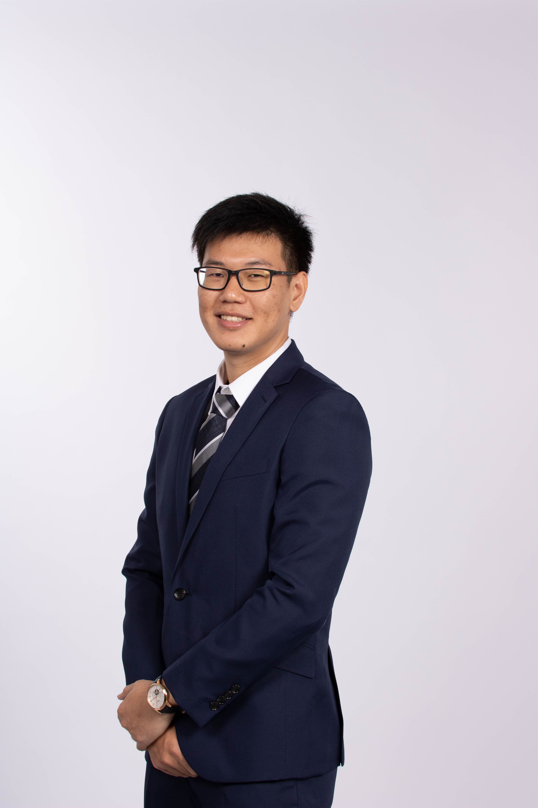
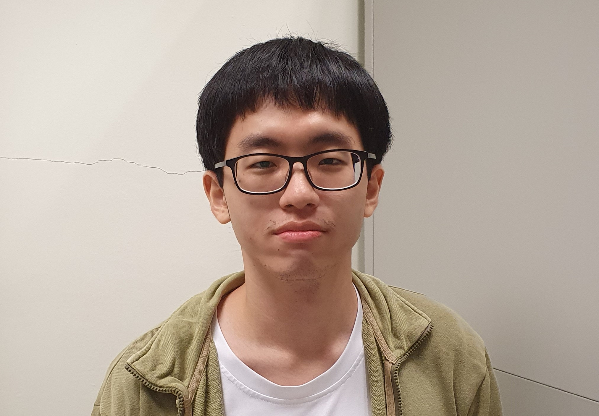
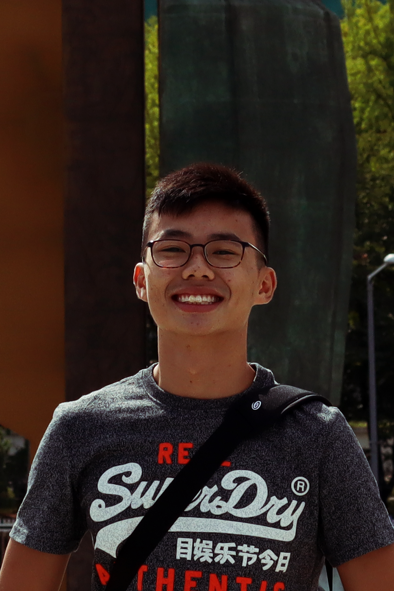

We are a team of five students based in the [School of Computing, National University of Singapore](http://www.comp.nus.edu.sg).
We hope to build upon the functionalities of AB3 and make it something unique and meaningful!

For any inquiries, please reach out to us at the email `renweilin@u.nus.edu`

## Project team

### Hans Sebastian Tirtaputra

[[homepage](https://www.linkedin.com/in/hans-sebastian-tirtaputra/?originalSubdomain=sg)]
[[github](https://github.com/hansebastian)]
[[portfolio](team/advisor.md)]

* Role: Project Advisor/Tutor

### Ren Weilin

[[github](http://github.com/wlren)]
[[portfolio](team/wlren.md)]

* Role: Team Lead
* Responsibilities: Manages the issues and milestones of tP, allocates tasks, software development

### Jeff Sieu Yong

[[github](http://github.com/jeffsieu)] [[portfolio](team/jeffsieu.md)]

* Role: Lead Developer
* Responsibilities: Handle complicated merge conflicts and feature development

### Chen Mingyi

[[github](https://github.com/mingyi456)]
[[portfolio](team/mingyi456.md)]

* Role: Developer
* Responsibilities: Dev Ops, ensuring the CI/CD pipeline of the project is maintained as project progresses

### Jonathan Lee Jing Yu

[[github](https://github.com/yeppog)]
[[portfolio](team/yeppog.md)]

* Role: Developer
* Responsibilities: Testing and QA, ensuring the project's testing coverage is maintained

### Koh Jia Xian

[[github](https://github.com/koh-jx)]
[[portfolio](team/koh-jx.md)]

* Role: Developer
* Responsibilities: Docs, UI, maintain documentation of project and setting the UI theme of the GUI
