- Table of Contents
{:toc}

---

## **Acknowledgements**

- {list here sources of all reused/adapted ideas, code, documentation, and third-party libraries -- include links to the original source as well}
- PlantUML was used for the UML diagrams in this project.
---

## **Setting up, getting started**

Refer to the guide [_Setting up and getting started_](SettingUp.md).

---

## **Design**

<div markdown="span" class="alert alert-primary">

:bulb: **Tip:** The `.puml` files used to create diagrams in this document can be found in the [diagrams](https://github.com/se-edu/addressbook-level3/tree/master/docs/diagrams/) folder. Refer to the [_PlantUML Tutorial_ at se-edu/guides](https://se-education.org/guides/tutorials/plantUml.html) to learn how to create and edit diagrams.

</div>

### Architecture


The **_Architecture Diagram_** given above explains the high-level design of the App.

Given below is a quick overview of main components and how they interact with each other.

**Main components of the architecture**

**`Main`** has two classes called [`Main`](https://github.com/se-edu/addressbook-level3/tree/master/src/main/java/seedu/address/Main.java) and [`MainApp`](https://github.com/se-edu/addressbook-level3/tree/master/src/main/java/seedu/address/MainApp.java). It is responsible for,

- At app launch: Initializes the components in the correct sequence, and connects them up with each other.
- At shut down: Shuts down the components and invokes cleanup methods where necessary.

[**`Commons`**](#common-classes) represents a collection of classes used by multiple other components.

The rest of the App consists of four components.

- [**`UI`**](#ui-component): The UI of the App.
- [**`Logic`**](#logic-component): The command executor.
- [**`Model`**](#model-component): Holds the data of the App in memory.
- [**`Storage`**](#storage-component): Reads data from, and writes data to, the hard disk.

**How the architecture components interact with each other**

The _Sequence Diagram_ below shows how the components interact with each other for the scenario where the user issues the command `delete 1`.

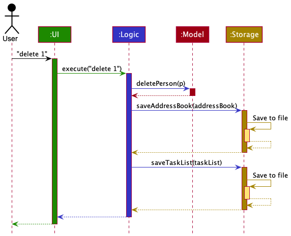

Each of the four main components (also shown in the diagram above),

- defines its _API_ in an `interface` with the same name as the Component.
- implements its functionality using a concrete `{Component Name}Manager` class (which follows the corresponding API `interface` mentioned in the previous point.

For example, the `Logic` component defines its API in the `Logic.java` interface and implements its functionality using the `LogicManager.java` class which follows the `Logic` interface. Other components interact with a given component through its interface rather than the concrete class (reason: to prevent outside component's being coupled to the implementation of a component), as illustrated in the (partial) class diagram below.


The sections below give more details of each component.

### UI component

The **API** of this component is specified in [`Ui.java`](https://github.com/se-edu/addressbook-level3/tree/master/src/main/java/seedu/address/ui/Ui.java)


The UI consists of a `MainWindow` that is made up of parts e.g.`CommandBox`, `ResultDisplay`, `PersonListPanel`, `StatusBarFooter` etc. All these, including the `MainWindow`, inherit from the abstract `UiPart` class which captures the commonalities between classes that represent parts of the visible GUI.

The `UI` component uses the JavaFx UI framework. The layout of these UI parts are defined in matching `.fxml` files that are in the `src/main/resources/view` folder. For example, the layout of the [`MainWindow`](https://github.com/se-edu/addressbook-level3/tree/master/src/main/java/seedu/address/ui/MainWindow.java) is specified in [`MainWindow.fxml`](https://github.com/se-edu/addressbook-level3/tree/master/src/main/resources/view/MainWindow.fxml)

The `UI` component,

- executes user commands using the `Logic` component.
- listens for changes to `Model` data so that the UI can be updated with the modified data.
- keeps a reference to the `Logic` component, because the `UI` relies on the `Logic` to execute commands.
- depends on some classes in the `Model` component, as it displays `Person` object residing in the `Model`.

### Logic component

**API** : [`Logic.java`](https://github.com/se-edu/addressbook-level3/tree/master/src/main/java/seedu/address/logic/Logic.java)

Here's a (partial) class diagram of the `Logic` component:


How the `Logic` component works:

1. When `Logic` is called upon to execute a command, it uses the `AddressBookParser` class to parse the user command.
1. This results in a `Command` object (more precisely, an object of one of its subclasses e.g., `AddCommand`) which is executed by the `LogicManager`.
1. The command can communicate with the `Model` when it is executed (e.g. to add a person).
1. The result of the command execution is encapsulated as a `CommandResult` object which is returned back from `Logic`.

The Sequence Diagram below illustrates the interactions within the `Logic` component for the `execute("delete 1")` API call.


<div markdown="span" class="alert alert-info">:information_source: **Note:** The lifeline for `DeleteCommandParser` should end at the destroy marker (X) but due to a limitation of PlantUML, the lifeline reaches the end of diagram.
</div>

Here are the other classes in `Logic` (omitted from the class diagram above) that are used for parsing a user command:


How the parsing works:

- When called upon to parse a user command, the `AddressBookParser` class creates an `XYZCommandParser` (`XYZ` is a placeholder for the specific command name e.g., `AddCommandParser`) which uses the other classes shown above to parse the user command and create a `XYZCommand` object (e.g., `AddCommand`) which the `AddressBookParser` returns back as a `Command` object.
- All `XYZCommandParser` classes (e.g., `AddCommandParser`, `DeleteCommandParser`, ...) inherit from the `Parser` interface so that they can be treated similarly where possible e.g, during testing.

### Model component

**API** : [`Model.java`](https://github.com/se-edu/addressbook-level3/tree/master/src/main/java/seedu/address/model/Model.java)


The `Model` component,

- stores the address book data i.e., all `Person` objects (which are contained in a `UniquePersonList` object).
- stores the currently 'selected' `Person` objects (e.g., results of a search query) as a separate _filtered_ list which is exposed to outsiders as an unmodifiable `ObservableList<Person>` that can be 'observed' e.g. the UI can be bound to this list so that the UI automatically updates when the data in the list change.
- stores a `UserPref` object that represents the user’s preferences. This is exposed to the outside as a `ReadOnlyUserPref` objects.
- does not depend on any of the other three components (as the `Model` represents data entities of the domain, they should make sense on their own without depending on other components)

<div markdown="span" class="alert alert-info">:information_source: **Note:** An alternative (arguably, a more OOP) model is given below. It has a `Tag` list in the `AddressBook`, which `Person` references. This allows `AddressBook` to only require one `Tag` object per unique tag, instead of each `Person` needing their own `Tag` objects.<br>


</div>

### Storage component

**API** : [`Storage.java`](https://github.com/se-edu/addressbook-level3/tree/master/src/main/java/seedu/address/storage/Storage.java)

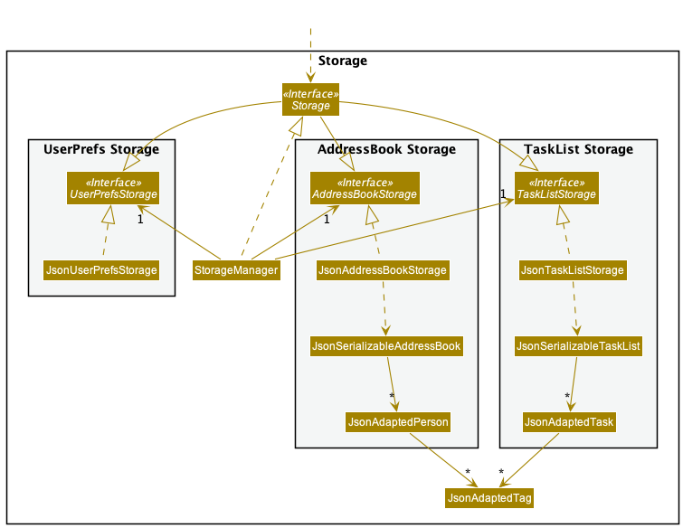

The `Storage` component,

- can save both address book data, task list data and user preference data in json format, and read them back into corresponding objects.
- inherits from both `AddressBookStorage` and `UserPrefStorage` and `TaskListStorage` , which means it can be treated as either one (if only the functionality of only one is needed).
- depends on some classes in the `Model` component (because the `Storage` component's job is to save/retrieve objects that belong to the `Model`)

### Common classes

Classes used by multiple components are in the `seedu.addressbook.commons` package.

---

## **Implementation**

This section describes some noteworthy details on how certain features are implemented.


### Task edit feature

#### Current Implementation

The task editing mechanism is done almost entirely within `EditTaskCommand` and the `EditTaskCommandParser` objects within the `Logic` component.
Each edit is represented by an `EditTaskDescriptor` object, which contains the new value(s) to edit the data in the current task to.

#### Example usage of `task edit`

Step 1: The user adds a task to the task list.

Step 2: The user types in the command `task edit 1 d/Example description` (suppose this string is called `s`)
The `EditTaskCommand` is created together with its corresponding `EditTaskDescriptor` as shown below.

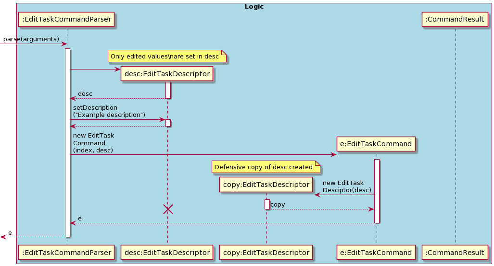

Step 3: The returned command is then executed. The copy of `EditTaskDescriptor` is used and destroyed and used during the `EditTaskCommand#createEditedTask` method.
The new edited copy of the task then replaces the current task in the task list (The task to edit is unmodified).

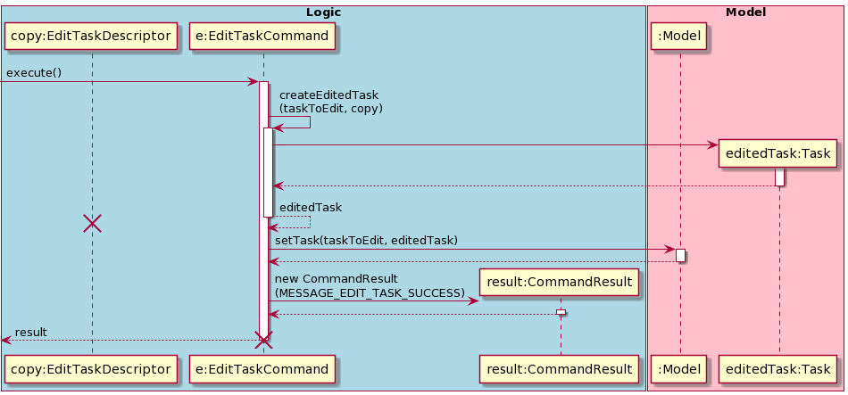

Step 4: The GUI is updated to show the task at index 1 with the new description "Example Description".


#### `EditTaskDescriptor` implementation

`EditTaskDescriptor` is implemented as a public nested class within EditTaskCommand. It is used to contain the edited values that are provided by the user.
`EditTaskDescriptor` has `get` and `set` methods that facilitate this operation:

- `setTitle()` / `getTitle()`
- `setDescription()` / `getDescription()`
- `setTimestamp()` / `getTimestamp()`
- `setTags()` / `getTags()`

where the `get` methods return `Optional<T>` objects containing the value to be edited, if any.

`EditTaskDescriptor` also has:
1. A constructor which accepts another `EditTaskDescriptor`, which creates a defensive copy of the original, called solely within the constructor of `EditTaskCommand`.
2. A `isAnyFieldEdited` method to facilitate error handling when the user does not provide any arguments to the command.

### Delete Feature

#### Current Implementation

The `delete` feature is implemented by acting on the current filtered`TaskList` with a one-based `Index` specified by the user, getting the target `Task` at the specified index, and removing it from the list.

#### Example Usage of `task delete`

1. User launches TaskMaster2103 and the `TaskList` is populated with existing `Task` entries.
2. User types in the command `task delete 1`, where `1` is the specified index given in one-based form.
3. The current state of the `TaskList` is obtained from `Model`.
4. The `Task` to be deleted is fetched from the `TaskList` using the specified `Index`, using its zero-based form.
5. The `Task` is deleted from the `Model`.
6. The `GUI` is updated to show the new `TaskList` with the `Task` deleted.

### Undo Feature

#### Current Implementation

The current implementation of the `undo` feature is through storing the command history of the user in `CommandHistory`
as a command stack, and returning the command from the stack whenever `undo` is called.

The abstract class `Command` has an additional method `undo()` to be implemented by the inheriting class
to model the correct undo behaviour. Commands that have previous states, such as `Find` with a specific `Predicate`,
store the previous state in the class.

The implementation of `CommandHistory` relies on a doubly linked list to efficiently traverse the stack and store the
state. A simple description of the stack can be seen below:

```text
Stack when commands are executed:
null <-> DeleteCommand1 <-> DeleteCommand2 <-> DeleteCommand2 <-> null
                                                                   ^current

Stack when a single undo is called
null <-> DeleteCommand1 <-> DeleteCommand2 <-> DeleteCommand2 <-> null
                                                           ^current

Stack after adding a command to the above state

null <-> DeleteCommand1 <-> DeleteCommand2 <-> DeleteCommand2 <-> DeleteCommand3 <-> null
                                                                                       ^current
```

#### Example usage of `undo`

1. User launches TaskMaster2103 and a new `CommandHistory` object is initialised in `Model`.
2. User invokes any valid command into TaskMaster2103 that successfully gets executed.
3. The successfully invoked command gets stored in the `CommandHistory` stack through `LogicManager`.
4. The user can now invoke `undo`, and when the user does so, the top-most `Command` in `CommandHistory`
   will be returned.
5. The top-most `Command` that was returned with have its `undo()` method executed.
6. The `undo()` method mutates `Model` to restore the state before the initial execution of the command.
7. The pointer in `CommandHistory` now shifts to the previous element in the stack if it exists.

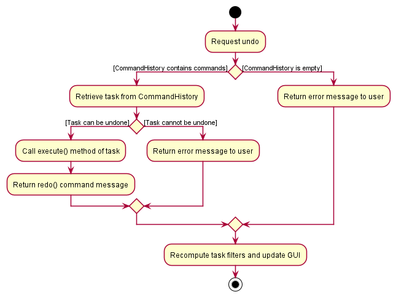

#### Implementation of `undo()`

Each `Command` will have a different way of implementing `undo()`, depending on the type of command.

1. Object-mutating Command:

    - Add: Deletes the object at the last index
    - Delete: Adds the deleted task at the original deleted index
    - Edit: Restores the state to the pre-edit state
    - Purge: Restores all the tasks that were purged

2. GUI View Commands:

    - Find/Sort/Filter: Restores the previous `Predicate` or `List<Filters>` that was in the `FilteredList`


### Redo feature

#### Current Implementation

Redo builds upon the fact that each command has its pre-defined function `execute()` and its own inverse `undo()`. This
allows for commands to be easily re-executed, simply by calling it's `execute()` method again.


The implementation of `CommandHistory` relies on a doubly linked list to efficiently traverse the stack and store the
state. A simple description of the stack with redo and undo actions can be seen below:

```text
Stack when commands are executed:
null <-> DeleteCommand1 <-> DeleteCommand2 <-> DeleteCommand3 <-> null
                                                                   ^current

Stack when two undo commands are called
null <-> DeleteCommand1 <-> DeleteCommand2 <-> DeleteCommand3 <-> null
                                      ^current

Stack after a single redo command is called
null <-> DeleteCommand1 <-> DeleteCommand2 <-> DeleteCommand3 <-> null
                                                         ^current

Stack after adding a command to the above state

null <-> DeleteCommand1 <-> DeleteCommand2 <-> DeleteCommand3 <-> DeleteCommand4 <-> null
                                                                                       ^current
```

#### Example usage of `redo`

1. User launches TaskMaster2103 and a new `CommandHistory` object is initialised in `Model`.
2. User invokes any valid command into TaskMaster2103 that successfully gets executed.
3. The successfully invoked command gets stored in the `CommandHistory` stack through `LogicManager`.
4. The user can now invoke `undo`, and when the user does so, the top-most `Command` in `CommandHistory`
   will be returned.
5. The top-most `Command` that was returned with have its `undo()` method executed.
6. The `undo()` method mutates `Model` to restore the state before the initial execution of the command.
7. The pointer in `CommandHistory` now shifts to the previous element in the stack if it exists.
8. The user now can use the `redo` command to redo the command in **Step 2**.


#### Important Note

`redo` cannot be called when no commands have been undone, as the `Command`s now have a boolean `canExecute` to
determine the state of the command. Executing `undo()` on a `Command` allows `execute()` to be called, and vice-versa,
executing `execute()` on a `Command` then allows for `undo()` to be called.

### Input history feature

Input history works similar to a terminal, where the up and down arrow keys can bring up recently executed commands.

#### Current implementation

The Input History feature uses a doubly linked list to store the string commands in the stack, and the up and down arrow
keys allow for traversing and returning the previous and next command respectively.

#### Example usage

1. User launches TaskMaster2103 and inputs a standard new `Command`.
2. If the command is valid, the executed command will be in the `InputHistory` stack and can be accessed by pressing UP.
3. Upon pressing UP, the user will see the command that was entered in Step 1 in the text box, and can quickly execute
that command again by pressing ENTER.
4. The user can also navigate to the top of the stack by using the DOWN key. If the stack reaches the end, it will
display either an empty string, or whatever string the user had input before using the arrow keys. This input is reset
everytime a new successful command is executed.


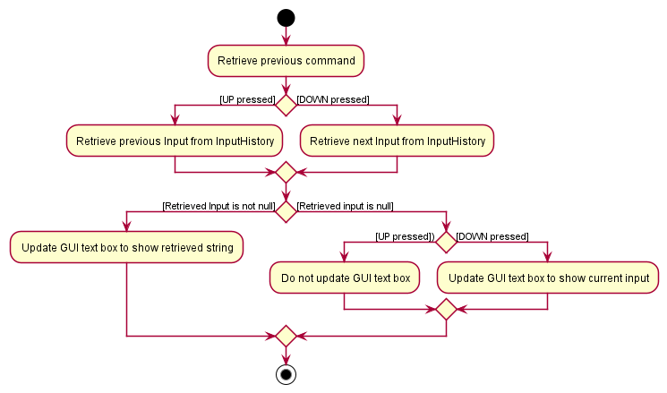

### Contacts feature

#### Current Implementation

`Contact` objects found in `Task`s contain a `Name`, which is used to compare each `Contact` with`AddressBook`, checking if a `Person` with the same name exists.
Each contact contains a `isInAddressBook` boolean value to keep track of this.

The checking of contacts is done in 2 scenarios:

1. when an action is executed that may change `Task`s' contacts (eg `task edit`, `task add`) or `Addressbook` (eg `add`, `delete`), or

2. when there is a change in a `Person`'s name through `edit`.

#### Scenario 1: Change in `AddressBook` or `Task` (If applicable)

As `ModelManager` may not know which task is affected, `updateAllTasksContacts()` is called to create a new defensive copy of every task in the task list.

Each new copy is updated with the correct `isInAddressBook` by comparing every `Contact` in the `Task` with every `Person` in AddressBook.
The copy then replaces the original task in the task list.

#### Scenario 2: Editing name of `Person` in `AddressBook`

Given the original and updated `Name`, `ModelManager` needs to overwrite tasks' contacts with the old name to that with the new name.

`ModelManager`'s `changeAllTaskContactNames(Name oldName, Name newName)` is called instead of `updateAllTasksContacts()`,
which replaces all tasks that contain the oldName with a copy containing the newName.

Since a name change implies that `oldName` and `newName` was and is present in the AddressBook respectively, `isInAddressBook` is guaranteed to be true as long as the `Contact` exists.
There is thus no need to check and change `isInAddressBook`.

#### Example usage

1. User launches TaskMaster2103 and adds a Person with name `EXAMPLE_NAME`.

2. TaskMaster2103 adds the Person to the `AddressBook`. It then checks if any task requires updating, as illustrated in the 2 sequence diagrams below.

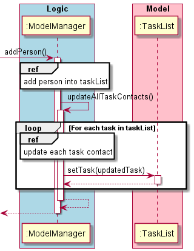

The sequence diagram below shows how each Task's contact set is updated. (Note: Most activation bars and return statements have been omitted to reduce clutter.)

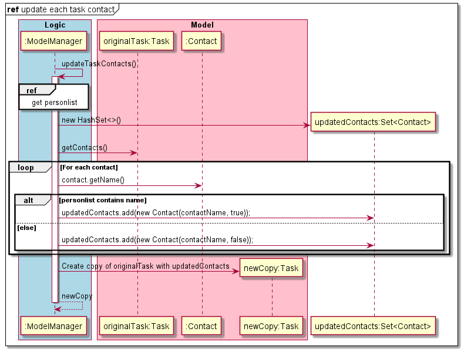

3. Changes are reflected in the updated GUI. The user will see the new added `Person`, along with any changes to the Task contacts. (Green if person exists in `AddressBook`, grey otherwise)

#### Alternatives

Searching through the task list, tasks' `Contact`s list and AddressBook may be computationally expensive. `updateAllTasksContacts()` goes to every `Task`,
and for every `Contact` in the task, it is compared to every `Person` in the AddressBook, assuming the worst-case (contact name does not exist in `AddressBook`).

A data structure, such as a HashTable could perhaps be used to store the locations of all `Person` names in the task list.
This way, despite a trade-off in terms of space, only affected tasks are directly be accessed and replaced with an updated copy.

### Task filter feature

#### Current implementation

The task filtering mechanism is facilitated by `Model`. Each task filter is internally represented by a `TaskFilter` instance, which contains a predicate that defines whether or not a task should be included in the filtered list.

`Model` implements the following filtering-related methods:

- `getAvailableTaskFilters()`
- `getSelectedTaskFilters()`
- `addTaskFilter(filter)`
- `removeTaskFilter(filter)`
- `setTaskFilter(filters)`

##### Example usage of `addTaskFilter`

Step 1. The user enters the command to filter tasks by the tag `important`.

Step 2. `ModelManager.recalculateFilteredTaskList()` is called. The selected `TaskFilter` instances are combined by
mapping them to their respective predicates using `TaskFilter.getPredicate()`. The resultant predicates are
combined by repeatedly applying `Predicate::and` on all predicates.

Step 3. The resultant predicate represents the collective filtering achieved by applying every selected task filter.

Step 4. The `FilteredList` representing the filtered task list is updated by calling
`filteredTasks.setPredicate(predicate)`.

Step 5. The GUI is updated automatically by JavaFX to show only tasks tagged `important`.

The following sequence diagram shows the above steps.

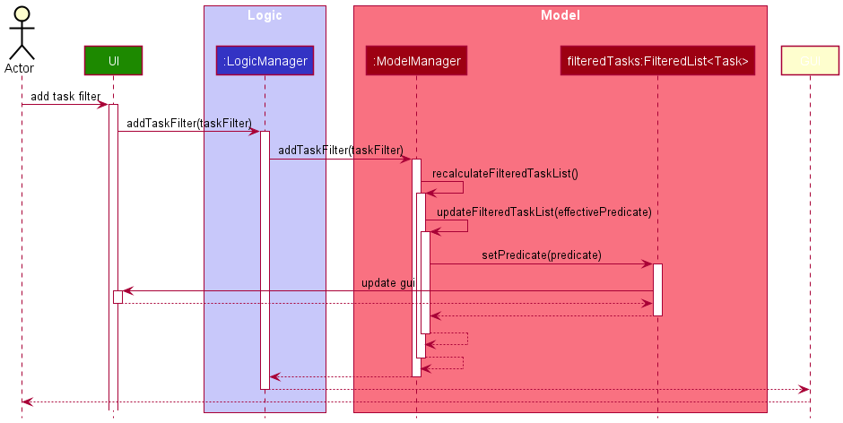

##### Adding tasks

Tasks can be filtered by tag. Whenever a task is added, the list of task filters will be recalculated to include the new tags introduced by adding that task.

Step 1. The user adds a new task.

Step 2. `Logic.addTask(task)` is called, which then delegates the responsibility to `ModelManager` via
`ModelManager.addTask(task)`.

Step 3. `ModelManager` recomputes task filter options with `recomputeAvailableTaskFilters()`.

Step 4. The new list will contain task filters representing done, and undone tasks.

Step 5. All `Tag`s are extracted from every task in the task list, and collected in a `Set`.

Step 6. Each `Tag` is mapped into a `TaskFilter` matching tasks that contain that corresponding tag.

Step 7. The list of available task filters is updated and reflected in the GUI.
The list of active filters remains unchanged.

The following sequence diagram shows how task filters are recalculated on the addition of a task.

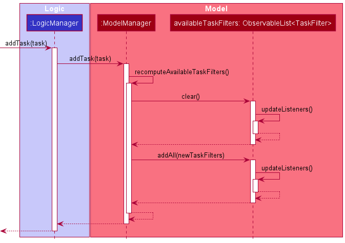

##### Deleting tasks

Deleting tasks may cause associated tags to be deleted from the entire task list. If a tag is deleted, its corresponding task filter will have to be deleted.


##### Finding tasks

Searching for tasks using a series of keywords also involves adding a `TaskFilter` to the `ModelManager`, but in this case it is needed to check whether an existing `TaskFilter` corresponding to a previous keyword search is still present. If so, this previous filter is removed and replaced with a new filter. This `TaskFilter` should be unique in the set  regardless of the keywords that are being searched for. This is implemented via a `KeywordTaskFilter` which extends `TaskFilter`. The `FindTaskCommand` will first remove the previous instance of `KeywordTaskFilter` before adding the new instance into `ModelManager`.

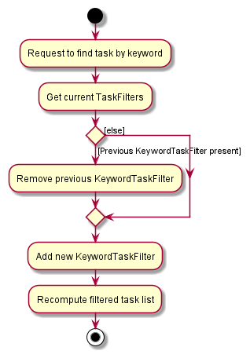

##### `TaskFilter` implementation

> Task filters are, in essence, predicates returning true or false depending on certain properties of tasks. For example, filtering by "done" tasks are checking for the completion status of a task. Therefore, task filters could be implemented as wrapper objects of instances of `Predicate<Task>`. Filters based on the same properties of a task are named the same way (e.g., for tag-based filters, `Tagged [important]` and `Tagged [work]`). It therefore made sense for a group of filters to have a common `toString()` implementation.

The current implementation of `TaskFilter` are through static, singleton-like constants exposed via the `TaskFilters` class. `TaskFilter#getPredicate()` returns the predicate associated with the matching condition of the filter, and `TaskFilter#invert()` returns a `TaskFilter` instance with an inverted matching condition (i.e., accepting tasks originally rejected, and rejecting originally accepted tasks).

Each of the following expressions return a `TaskFilter`:

1. `TaskFilters.FILTER_DONE`
2. `TaskFilters.FILTER_TAG(String tagName)`

`FILTER_DONE` is a `TaskFilter`, while `FILTER_TAG` is a unary function accepting a tag name and returning a `TaskFilter` accepting tasks containing that tag.

`TaskFilter` contains private constructors accepting a `Predicate<Task>` representing the matching condition of the filter. It also accepts a `Function<Boolean, String>`, accepting a boolean representing whether or not the filter is inverted, and returns its string representation.

##### Alternatives

1. Task filters could be implemented using a `FunctionalInterface` having a `boolean filter(Task task)` method. However, this does not allow a task filter to contain extra information like having a custom string representation.

### \[Proposed\] Data archiving

_{Explain here how the data archiving feature will be implemented}_

---

## **Documentation, logging, testing, configuration, dev-ops**

- [Documentation guide](Documentation.md)
- [Testing guide](Testing.md)
- [Logging guide](Logging.md)
- [Configuration guide](Configuration.md)
- [DevOps guide](DevOps.md)

---

## **Appendix: Requirements**

### Product scope

**Target user profile**:
Comprehensive user narrative [here](https://docs.google.com/document/d/1347lMg6wswsPC-WiistNluU2d8Ji2yV4FcAEMnzsk-A/edit?usp=sharing)

- has a need to manage a significant number of contacts.
- has a need to manage a significant number of tasks.
- prefer desktop apps over other types.
- is reasonably comfortable using CLI apps.
- is a student.
- has significant variety of tasks (eg mods, personal, sports etc).

**Value proposition**: allow students to easily keep track of their tasks for modules, school calenders, and meetings in a strealined manner and allow them to use either GUI/CLI options depending on whichever suits them better.

### User stories

Priorities: High (must have) - `* * *`, Medium (nice to have) - `* *`, Low (unlikely to have) - `*`

| Priority | As a …​                                                          | I want to …​                                                       | So that I can…​                                         |
| -------- | ---------------------------------------------------------------- | ------------------------------------------------------------------ | ------------------------------------------------------- |
| `* * *`  | student                                                          | add tasks into a tasklist                                          | keep a list of tasks I need to do                       |
| `* * *`  | student                                                          | delete tasks                                                       | remove tasks that are no longer applicable              |
| `* * *`  | student with one laptop                                          | access my data locally                                             | use the application without an internet connection      |
| `* * *`  | new user                                                         | use the GUI                                                        | use the app easily from the desktop                     |
| `* * *`  | student who often makes typos                                    | edit tasks                                                         | correct tasks that were entered wrongly                 |
| `* * *`  | student with similar tasks                                       | create skeleton templates                                          | add tasks without repeating actions                     |
| `* * *`  | student with different commitments                               | categorise tasks using tags                                        | differentiate whcih tasks belongs to which commitment   |
| `* * *`  | student with different commitments                               | overview of my tasks by workload                                   | understand which tasks I need to prioritise             |
| `* * *`  | student who is forgetful                                         | receive reminders                                                  | be reminded for upcoming tasks                          |
| `* * *`  | student who receives periodic assignments                        | create recurring tasks that repeat at a set interval               | save time                                               |
| `* *`    | student with varying type of tasks                               | attach various files or messages                                   | increase convenience of access                          |
| `* *`    | a veteran user                                                   | have CLI to organise my tasks                                      | save time from not having to point and click on the GUI |
| `* *`    | busy student                                                     | be able to add tasks using CLI                                     | save time from not needing to sort my schedule          |
| `* *`    | student that manages multiple projects across different modules  | tag tasks with contacts                                            | know who is participating in which meeting or task      |
| `* *`    | a student who love data and visualisations                       | view previously completed tasks over time                          | gain insights into my producitvity                      |
| `*`      | student with similar tasks                                       | create custom macros                                               | save time                                               |
| `*`      | student that is finishing their semester                         | purge data on tasks and templates                                  | remove clutter on my app                                |
| `*`      | student with many tasks                                          | track progress for tasks                                           | visualise the time required for each task               |
| `*`      | student who has to manage projects with peers                    | create tasks that can be emailed to individuals on my contact list | facilitate quick communication                          |
| `*`      | student who easily gets bored focusing too much on a single task | shuffle the arrangement of upcoming tasks                          | work on another task with similar priority              |
| `*`      | student who may make mistakes                                    | undo my changes                                                    | revert any changes if needed                            |
| `*`      | student who has some tasks of utmost importance                  | designate special tasks that block out a certain time period       | avoid scheduling other tasks that clash with them       |

### Use cases

(For all use cases below, the **System** is the `TaskMaster2103` and the **Actor** is the `user`, unless specified otherwise)

#### Use case: UCP01 - Add a person

##### MSS

1. User requests add a person.

2. TaskMaster2103 shows a list of updated persons.

   Use case ends.

##### Extensions

- 1a. An invalid field is specified

    - 1a1. TaskMaster2103 shows an error message.

      Use case resumes at step 1.

- 2a. Taskmaster2103 adds a person who is a contact in a task.

    - 2a1. TaskMaster2103 updates the tasks' contacts.

    Use case ends.

#### Use case: UCP02 - Edit a person

##### MSS

1. User requests to list persons.

2. TaskMaster2103 shows a list of persons.

3. User requests to edit a specific person in the list with the new values of the fields to be updated.

4. TaskMaster2103 updates the specified fields of the person.

   Use case ends.

##### Extensions

- 2a. The list is empty.

  Use case ends.

- 3a. The given index is invalid.

    - 3a1. TaskMaster2103 shows an error message.

      Use case resumes at step 2.

- 3b1. A field is specified wrongly.

    - 3a1. TaskMaster2103 shows an error message.

      Use case resumes at step 2.

- 4a. TaskMaster2103 edits a person's name who is a contact in a task.

    - 4a1. TaskMaster2103 updates the tasks' contact's name.

  Use case ends.


#### Use case: UCP03 - Delete a person

##### MSS

1.  User requests to list persons.
2.  TaskMaster2103 shows a list of persons.
3.  User requests to delete a specific person in the list.
4.  TaskMaster2103 deletes the person.

    Use case ends.

##### Extensions

- 2a. The list is empty.

  Use case ends.

- 3a. The given index is invalid.

    - 3a1. TaskMaster2103 shows an error message.

      Use case resumes at step 2.

- 4a. TaskMaster2103 deletes a person who is a contact in a task.

    - 4a1. TaskMaster2103 updates the tasks' contacts.

    Use case ends.

#### Use case: UCP04 - Search for a person

##### MSS

1. User requests to search for a list of keywords.

2. TaskMaster2103 shows a list of people whose names match any of the keywords.

   Use case ends.

#### Use case: UCT01 - Add a task

##### MSS

1.  User requests to add a task.
2.  TaskMaster2103 shows an updated list of tasks.

    Use case ends.

##### Extensions

- 1a. The task does not contain a title.

    - 1a1. TaskMaster2103 shows an error message.

      Use case resumes at step 1.

#### Use case: UCT02 - Edit a task

##### MSS

1.  User requests to list tasks.
2.  TaskMaster2103 shows a list of tasks.
3.  User requests to edit a specific task in the list.
4.  TaskMaster2103 edits the task.

    Use case ends.

##### Extensions

- 2a. The list is empty.

  Use case ends.

- 3a. The given index is invalid.

    - 3a1. TaskMaster2103 shows an error message.

      Use case resumes at step 2.

#### Use case: UCT03 - Delete a task

##### MSS

1.  User requests to list tasks.
2.  TaskMaster2103 shows a list of tasks.
3.  User requests to delete a specific task in the list.
4.  TaskMaster2103 deletes the task.

    Use case ends.

##### Extensions

- 2a. The list is empty.

  Use case ends.

- 3a. The given index is invalid.

    - 3a1. TaskMaster2103 shows an error message.

      Use case resumes at step 2.

#### Use case: UCT04 - Mark a task as done

##### MSS

1. User requests to list tasks.

2. TaskMaster2103 shows a list of tasks.

3. User requests to mark a specific task in the list as done.

4. TaskMaster2103 marks the task as done.

   Use case ends.

##### Extensions

- 2a. The list is empty.

  Use case ends.

- 3a. The given index is invalid.

    - 3a1. TaskMaster2103 shows an error message.

      Use case resumes at step 2.

#### Use case: UCT05 - Filter task list by done status

##### MSS

1. User requests to list tasks that are done.

2. TaskMaster2103 shows a list of done tasks.

   Use case ends.

##### Extensions

- 1a. User requests to list tasks that are undone.

    - 1a1. TaskMaster2103 shows a list of undone tasks.

      Use case ends.


#### Use case: UCT06 - Filter task list by tag

##### MSS

1. User requests to list tasks that contain a specified tag.

2. TaskMaster2103 shows a list of tasks.

   Use case ends.

#### Use case: UCT07 - Search task list by keywords

##### MSS

1. User requests to search for tasks that contain a keyword / list of keywords.

2. TaskMaster2103 shows a list of tasks.

   Use case ends.

#### Use case: UCT08 - Undo previous command

##### MSS

1. User requests to undo a previously entered command.

2. TaskMaster2103 undoes the previous command.

   Use case ends.

##### Extensions

- 2a. There are no previously entered commands.

    - 2a1. TaskMaster2103 shows an error message.

      Use case ends.

- 2b. The undo limit is reached.

    - 3a1. TaskMaster2103 shows an error message.

      Use case ends.

#### Use case: UCT08 - Redo previous command

##### MSS

1. User requests to undo a previously <u>undone command (UCT07)</u>.

2. TaskMaster2103 redoes the previously undone command.

   Use case ends.

##### Extensions

- 2a. There are no previously undone commands.

    - 2a1. TaskMaster2103 shows an error message.

      Use case ends.

- 2b. The redo limit is reached.

    - 3a1. TaskMaster2103 shows an error message.

      Use case ends.


#### Use case: UCT10 - Purge command

##### MSS

1. User requests to <u>filter the list by tag(UCT05)</u>.

2. TaskMaster2103 shows a list of filtered tasks.

2. User requests to purge all tasks.

3. TaskMaster2103 purges all tasks visible under the filter, but not the currently-applied filters.

   Use case ends.

##### Extensions

- 1a. User requests to <u>filter the list by done (UCT06)</u>

  Use case resumes at step 2.

- 1b. User requests to <u>filter the list by keywords (UCT07)</u>

  Use case resumes at step 2.

- 2a. The list is empty.

  Use case ends.


### Non-Functional Requirements

1.  Should work on any _mainstream OS_ as long as it has Java `11` or above installed.
2.  Should be able to work on both 32-bit and 64-bit environments.
3.  A user with above average typing speed of 60 words per minute for regular English text (i.e. not code, not system admin commands) should be able to accomplish most of the tasks faster using commands than using the mouse.
4.  The system should respond within 1 second to any (valid or invalid) command given via typing or GUI.
5.  The system will store the data in a JSON file locally, and will not have a server component.
6.  Older versions of locally-stored data should be compatible with newer versions of the app.
7.  The system should load the locally-stored data within 1 second when the app starts up.
8.  The app should save any changes to the data immediately when the command is processed, to avoid possible data loss.
9.  The app should only read the JSON file for the locally-stored list, and nothing else.
10. The locally-stored data should not exceed 5GB in size, for tasks, tags and templates.

### Glossary

- **Mainstream OS**: Windows, Linux, Unix, OS-X
- **Locally-stored data**: Data stored under `./data/` folder like `addressbook.json`
- **Given index (of a task)**: The location of the task in the current visible tasklist. First task is **1**, and increases in ascending order.
- **Templates**: User-defined preset format for a task
- **Tags**: User-defined label attached a task to provide identification and/or information

---

## **Appendix: Instructions for manual testing**

Given below are instructions to test the app manually.

<div markdown="span" class="alert alert-info">:information_source: **Note:** These instructions only provide a starting point for testers to work on;
testers are expected to do more *exploratory* testing.

</div>

### Launch and shutdown

1. Initial launch

   1. Download the jar file and copy into an empty folder

   1. Double-click the jar file Expected: Shows the GUI with a set of sample contacts. The window size may not be optimum.

1. Saving window preferences

   1. Resize the window to an optimum size. Move the window to a different location. Close the window.

   1. Re-launch the app by double-clicking the jar file.<br>
      Expected: The most recent window size and location is retained.

1. _{ more test cases …​ }_

### Deleting a person

1. Deleting a person while all persons are being shown

   1. Prerequisites: List all persons using the `list` command. Multiple persons in the list.

   1. Test case: `delete 1`<br>
      Expected: First contact is deleted from the list. Details of the deleted contact shown in the status message. Timestamp in the status bar is updated.

   1. Test case: `delete 0`<br>
      Expected: No person is deleted. Error details shown in the status message. Status bar remains the same.

   1. Other incorrect delete commands to try: `delete`, `delete x`, `...` (where x is larger than the list size)<br>
      Expected: Similar to previous.

1. _{ more test cases …​ }_

### Saving data

1. Dealing with missing/corrupted data files

   1. _{explain how to simulate a missing/corrupted file, and the expected behavior}_

1. _{ more test cases …​ }_
