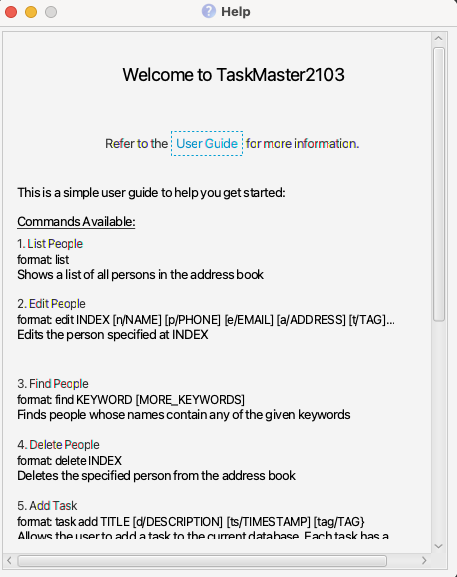
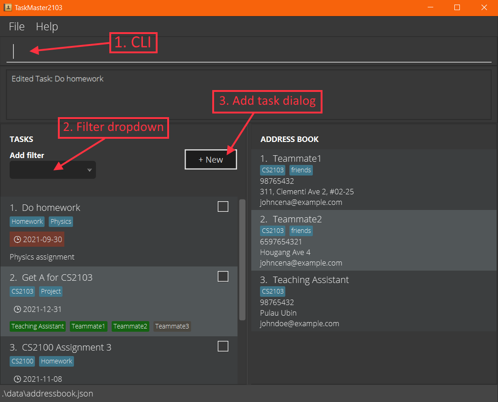
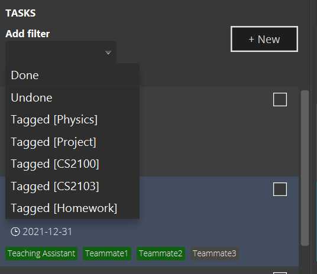
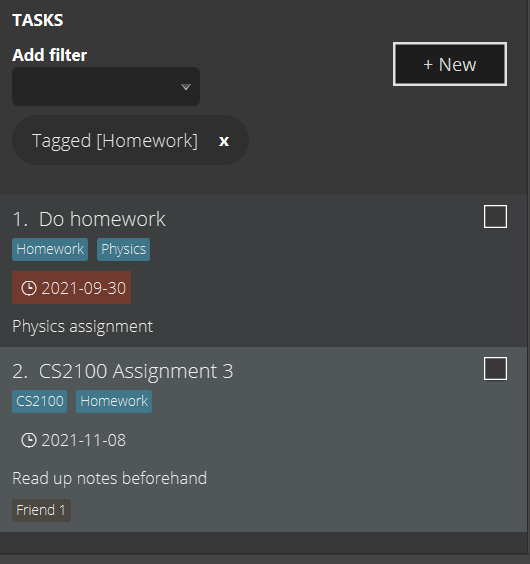
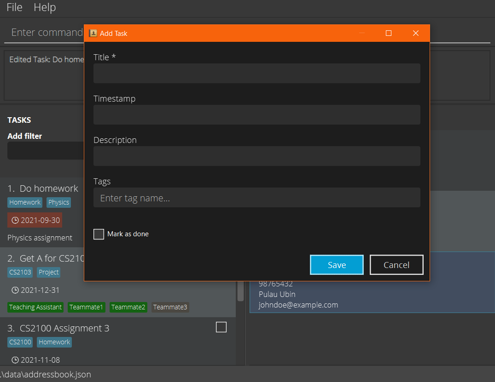
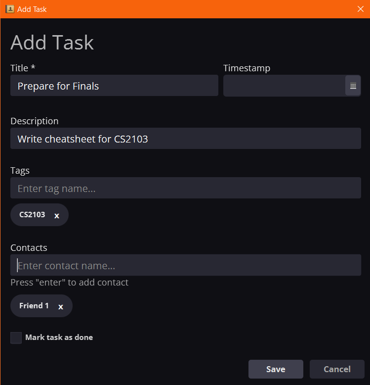
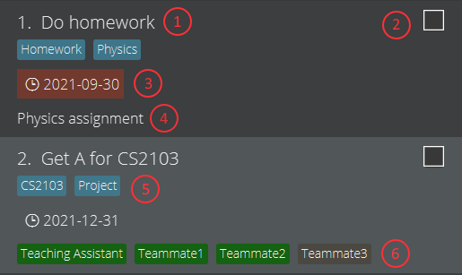

# TaskMaster2103 V1.4

TaskMaster2103 V1.4 is a desktop app for students to manage their tasks and contacts, optimized for
use via a CLI while still having the benefits of a GUI option if needed.

## Table of Contents

1. [Quick Start](#quickstart)
2. [Features](#features)
   1. [Address Book Commands](#ab3comm)
   2. [Task List Commands](#tasklistcomm)
   3. [Other Shortcuts/Commands](#shortcuts)
   4. [GUI Guide](#gui)
3. [FAQ](#faq)
4. [Command Summary](#commandsummary)

---

## Quick start

1. Ensure you have Java `11` or above installed in your Computer.

1. Download the latest `taskmaster.jar` from [here](https://github.com/AY2122S1-CS2103-F09-2/tp/releases).

1. Copy the file to the folder you want to use as the _home folder_ for your AddressBook.

1. Double-click the file to start the app. The GUI similar to the below should appear in a few seconds. Note how the app contains some sample data. 
   

1. Type the command in the command box and press Enter to execute it. e.g. typing **`help`** and pressing Enter will open the help window. 
   Some example commands you can try:

   - **`list`** : Lists all contacts.

   - **`add`**`n/John Doe p/98765432 e/johnd@example.com a/John street, block 123, #01-01` : Adds a contact named `John Doe` to the Address Book.

   - **`delete`**`3` : Deletes the 3rd contact shown in the current list.

   - **`clear`** : Deletes all contacts.

   - **`exit`** : Exits the app.

1. Refer to the [Features](#features) below for details of each command.

---

## Features

**:information_source: Notes about the command format:** 

- Words in `UPPER_CASE` are the parameters to be supplied by the user. 
  e.g. in `add n/NAME`, `NAME` is a parameter which can be used as `add n/John Doe`.

- Items in square brackets are optional. 
  e.g `n/NAME [t/TAG]` can be used as `n/John Doe t/friend` or as `n/John Doe`.

- Items with `…`​ after them can be used multiple times including zero times. 
  e.g. `[t/TAG]…​` can be used as ``(i.e. 0 times),`t/friend`, `t/friend t/family` etc.

- Parameters can be in any order. 
  e.g. if the command specifies `n/NAME p/PHONE_NUMBER`, `p/PHONE_NUMBER n/NAME` is also acceptable.

- Parameters must be provided exactly.

    - Each parameter is expected only once in the command. If you specified it multiple times,
      an error message will be shown.

    - If an extraneous parameter is specified, an error message will be shown. (Does not apply for tags or contacts)

    - Parameter or argument values cannot contain the character `/`. An error message will be shown if `/` is present in the argument value. For example, `task add 1/2` is invalid, and can be replaced with valid alternatives such as `task add 1 or 2` instead.

### Notable command prefix formats

Some prefixes require the user to follow certain formats in their commands.

| **Prefix**  | **Use** | **Format** |
| ------------- | ------------- | ------------- |
| `ts`  | Timestamp, represents a date  | `DD`-`MM`-`YYYY`    1. Single-digit dates or months require a `0` appended at the front. For example, 3rd July 2021 is represented as `03-07-2021`.    2. The day, month and year are separated by hyphens. |
| `e`  | Email  | `local-part@domain`    1. The local-part should only contain alphanumeric characters and these special characters, excluding the parentheses, (+_.-). The local-part may not start or end with any special characters.  2. This is followed by a '@' and then a domain name. The domain name is made up of domain labels separated by periods.    The domain name must:       - end with a domain label at least 2 characters long   - have each domain label start and end with alphanumeric characters   - have each domain label consist of alphanumeric characters, separated only by hyphens, if any. |

### Viewing help : `help`

Shows a message explaning how to access the help page.

Format: `help`

## Address Book Commands

### Adding a person: `add`

Adds a person to the address book.

Format: `add n/NAME p/PHONE_NUMBER e/EMAIL a/ADDRESS [t/TAG]…​`

:bulb: **Tip:**
A person can have any number of tags (including 0)

Examples:

- `add n/John Doe p/98765432 e/johnd@example.com a/John street, block 123, #01-01`
- `add n/Betsy Crowe t/friend e/betsycrowe@example.com a/Newgate Prison p/1234567 t/criminal`

### Listing all persons : `list`

Shows a list of all persons in the address book.

Format: `list`

### Editing a person : `edit`

Edits an existing person in the address book.

Format: `edit INDEX [n/NAME] [p/PHONE] [e/EMAIL] [a/ADDRESS] [t/TAG]…​`

- Edits the person at the specified `INDEX`. The index refers to the index number shown in the displayed person list. The index **must be a positive integer** 1, 2, 3, …​
- At least one of the optional fields must be provided.
- Existing values will be updated to the input values.
- When editing tags, the existing tags of the person will be removed i.e adding of tags is not cumulative.
- You can remove all the person’s tags by typing `t/` without
  specifying any tags after it.
- If the edited Person's name corresponds to a name of a contact in any task, the corresponding tasks' contacts name will be changed accordingly as well. (if applicable)

Examples:

- `edit 1 p/91234567 e/johndoe@example.com` Edits the phone number and email address of the 1st person to be `91234567` and `johndoe@example.com` respectively.
- `edit 2 n/Betsy Crower t/` Edits the name of the 2nd person to be `Betsy Crower` and clears all existing tags.

### Locating persons by name: `find`

Finds persons whose names contain any of the given keywords.

Format: `find KEYWORD [MORE_KEYWORDS]`

- The search is case-insensitive. e.g `hans` will match `Hans`
- The order of the keywords does not matter. e.g. `Hans Bo` will match `Bo Hans`
- Only the name is searched.
- Only full words will be matched e.g. `Han` will not match `Hans`
- Persons matching at least one keyword will be returned (i.e. `OR` search).
  e.g. `Hans Bo` will return `Hans Gruber`, `Bo Yang`

Examples:

- `find John` returns `john` and `John Doe`
- `find teammate1 teaching` returns `Teammate1`, `Teaching Assistant` 
  

### Deleting a person : `delete`

Deletes the specified person from the address book.

Format: `delete INDEX`

- Deletes the person at the specified `INDEX`.
- The index refers to the index number shown in the displayed person list.
- The index **must be a positive integer** 1, 2, 3, …​

Examples:

- `list` followed by `delete 2` deletes the 2nd person in the address book.
- `find Betsy` followed by `delete 1` deletes the 1st person in the results of the `find` command.

### Clearing all entries : `clear`

Clears all entries from the address book.

Format: `clear`

## Task List Commands

### Adding a task: `task add`

Allows the user to add a task to the current database.

Each task has a compulsory title field, and textual description, timestamp, and tag and contact as optional fields.

**Format:**

`task add TITLE [d/DESCRIPTION] [ts/TIMESTAMP] [t/TAG]… [c/CONTACT]…`

**Example:**

`task add Submit CS2103 UG Draft ts/16-09-2021 c/Team Member`

### Listing tasks: `task list`

Lists all tasks in the task list. Clears any existing filters.

**Format:**

`task list`

#### Filtering tasks

Tasks can be filtered by completion status and/or tags. Show only completed tasks with `done/`, pending tasks with `undone/` and tasks with a certain tag `TAG` with `tag/TAG`.

> Note: `undone/` and `done/` flags cannot be specified at the same time.

**Format:**

`task list [done/ OR undone/] [t/TAG]…`

### Editing a task: `task edit`

Edits an existing task in the task list

**Format:**

`task edit INDEX [ti/TITLE] [d/DESCRIPTION] [ts/TIMESTAMP] [t/TAG]… [c/CONTACT]…`

- Edits the task at the specified INDEX. The index refers to the index number shown in the displayed task list. The index must be a positive integer 1,2,3 …
- At least one of the optional fields must be provided
- Existing values will be updated to the input values. When editing tags or contacts, the existing tags of the task will be removed i.e adding of tags and contacts are not cumulative.
- You can remove all the task’s tags by typing `t/` without specifying any tags after it. This applies to contacts and `c/` as well.

**Example:**

`task edit 1 ti/CS2103 Week 6 Quiz ts/30-10-2021`

### Finding tasks: `task find`

Finds all tasks which contain any of the given keywords in their title or description

Format: `task find KEYWORD [MORE_KEYWORDS]`

- The search is case-insensitive. e.g `cs2103` will match `CS2103`
- The order of the keywords does not matter. e.g. `PE dry run` will match `dry run PE`
- Only the title and description will be searched.
- Only full words will be matched e.g. `meeting` will not match `meetings`
- Tasks matching at least one keyword will be returned (i.e. `OR` search).
  e.g. `CS2103 meeting` will return `CS2103 tP`, `online meeting`

Examples:

- `task find CS2103` returns `CS2103 tP` and `CS2103 PE`
- `task find CS2103 project` returns `CS2103 tP`, `UROPS project` 

### Completing a task: `task done`

Completes an existing task in the task list, or marks it as not done if it is already done.

**Format:**

`task done INDEX`

- Completes the task at the specified INDEX. The index refers to the index number shown in the displayed task list. The index must be a positive integer 1,2,3 …

- If the task at the specified INDEX is already done, this command should un-complete the task, marking it as not done.

**Example:**

`task done 1`

### Deleting a task: `task delete`

Deletes a specified task from the tasks list by a given index.

**Format:**

`task delete INDEX`

- The index refers to the INDEX number of the task that is currently displayed in the GUI.

**Example:**

`task delete 2`

### Purge all visible tasks : `task purge`

Clears and deletes all visible (filtered) tasks from the TaskMaster.

Format: `task purge`

- Any active filter(s) will remain even after the purge to prevent possible confusion.

## Other Shortcuts/Commands

### Undo previous command : `undo`

Undos the previous command, returning the user back to the previous state, up to a maximum of 15 previous commands.

Format: `undo`

This command can also be invoked through using the shortcut `CTRL + Z` or `CMD + Z`.

### Redo previous command : `redo`

Redo the previous command, returning the user back to the previous state, up to a maximum of 15 previous commands.

Format: `redo`

This command can also be invoked through using the shortcut `CTRL + Y` or `CMD + Y` or `CTRL + SHIFT + Z`
or `CMD + SHIFT + Z`.

### Retrieving previous commands:

Retrieves the previous successfully executed commands.

This only works through the CLI by using the `UP` or `DOWN` arrow keys. Anything that was typed but not executed is
automatically cached, but is removed when a new command is executed.

By pressing the `UP` or `DOWN` arrow keys, the text box will have its text input cycle through the past executed commands. Nothing
happens if there were no commands executed.

### Exiting the program : `exit`

Exits the program.

Format: `exit`

### Saving the data

TaskMaster data are saved in the hard disk automatically after any command that changes the data. There is no need to save manually.

### Editing the data file

TaskMaster data are saved as JSON files corresponding to the task list and address book  at `[JAR file location]/data/`. Advanced users are welcome to update data directly by editing that data file.

:exclamation: **Caution:**
If your changes to the data file makes its format invalid, TaskMaster will discard all data and start with an empty data file at the next run.

---

## Using the GUI

The following image shows an example of the main menu. The task list is shown on the left of the app, while the address book is shown on the right.

### 1. CLI

- A Command Line Interface is provided for users to type commands.
- If not focused on the CLI, pressing the `/` key will allow the user to focus on the text box and immediately begin typing.
- To retrieve previously typed commands, you may see "Retrieving previous commands" in the "Other Shortcuts/Commands" section above.

### 2. Filter Dropdown

- A filter can be used to filter the list of tasks. By clicking the filter dropdown, the following dropdown will be shown.

Clicking on any one of the dropdown options will filter the task list based on the filter chosen, as shown.

- More than 1 filter can be applied at any time. However, for the `Done` and `Undone` filters, only one can be selected at any time.
- Using the `task find` command also adds to the list of filters.

### 3. Adding a task via GUI

Upon clicking the Add Task Dialog button, the following popup window should appear.

Enter relevant text into the text fields. 

To add tags or contacts, type the tag into the text field and press the `Enter` key. The tag should be displayed as seen below.

To finish adding a task, click the `Save` button. The task should be added to the task list.

- Text typed in the tags and contact text fields will not be added to the task if `Enter` is not pressed to add the tag/contact.

### The Task pane

Each task pane represents one task in the task list. Below are examples of 2 tasks. For your reference, relevant components are numbered from 1-6.

Legend:

| **Number**  | **Name** | **Description** |
| ------------- | ------------- | ------------- |
| 1  | Task title  | Mandatory field. |
| 2  | Done checkbox |  Checkbox will be ticked if the task is complete. It will not be ticked otherwise.    Checkboxes can be clicked to toggle the task's completion status from the GUI directly. |
| 3  | Timestamp  | Optional field.    No highlight by default. If the task date has past, the timestamp would be highlighted in red. |
| 4  | Description of the task  | Optional field. |
| 5  | Tags  | Optional field.    All tags are displayed in alphabetical order and highlighted blue. |
| 6  | Timestamp, represents a date  |  Optional field.    By default, contacts are highlighted grey. However, should a contact's name correspond to a person in the Address Book, it would be highlighted green instead.    All contacts are displayed in alphabetical order, grouped by whether or not the appear in the Address Book.    If the edited Person's name corresponds to a name of a contact in any task, the corresponding tasks' contact name will be changed accordingly as well.

### Editing a task via GUI

Double-clicking on a task pane will bring the user to the Edit Task Dialog. See the above section "Adding a task via GUI" for details regarding the task dialog.

## FAQ

**Q**: How do I transfer my data to another Computer? 
**A**: Install the app in the other computer and overwrite the empty data file it creates with the file that contains the data of your previous TaskMaster2103 home folder.

---

## Command summary

| Action          | Format, Examples                                                                                                                                                      |
| --------------- | --------------------------------------------------------------------------------------------------------------------------------------------------------------------- |
|***Address Book Commands*** |
| **Add**         | `add n/NAME p/PHONE_NUMBER e/EMAIL a/ADDRESS [t/TAG]…`   e.g., `add n/James Ho p/22224444 e/jamesho@example.com a/123, Clementi Rd, 1234665 t/friend t/colleague` |
| **List**        | `list`                                                                                                                                                                |
| **Edit**        | `edit INDEX [n/NAME] [p/PHONE_NUMBER] [e/EMAIL] [a/ADDRESS] [t/TAG]…`  e.g.,`edit 2 n/James Lee e/jameslee@example.com`                                           |
| **Find**        | `find KEYWORD [MORE_KEYWORDS]`  e.g., `find James Jake`                                                                                                            |
| **Delete**      | `delete INDEX`  e.g., `delete 3`                                                                                                                                   |
| **Clear**       | `clear`                                                                                                                                                               |
|***Task List Commands***    |
| **Task Add**    | `task add TITLE [d/DESCRIPTION] [ts/TIMESTAMP] [t/TAG] [c/CONTACT]`                                                                                                             |
| **Task List**   | `task list [done/] [undone/] [t/TAG]` |
| **Task Edit**   | `task edit INDEX [ti/TITLE] [d/DESCRIPTION] [ts/TIMESTAMP] [t/TAG] [c/CONTACT]…`   e.g.,`task edit 1 ti/CS2103 Week 6 Quiz`                                                    |
| **Task Find**   | `task find KEYWORD [MORE_KEYWORDS]`|
| **Task Delete** | `task delete INDEX`  e.g., `task delete 3`                                                                                                                         |
| **Task Purge** | `task purge`                                                                                                                         |
|***Other Commands***|
| **Undo**        | `undo`                                                                                                                                                                |
| **Redo**        | `redo`                                                                                                                                                                |
| **Help**        | `help`                                                                                                                                                                |
| **Exit**        | `exit`                                                                                                                                                                |
